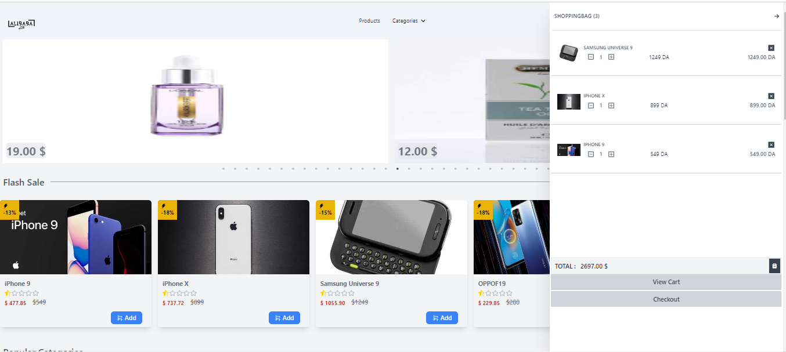

 project's name : AlibabaLite
 
 
 Description of the project : This Next.js-based e-commerce website allows users to browse, filter, and purchase products. It features product listings, individual product pages, shopping cart functionality, and the ability to filter products by name, price, category, and rating. Users can add or remove items from their cart, with quantity tracking. The project demonstrates practical front-end development skills and includes Git-based project management.
 
 
 
 Tools used :
 Next.js
 tailwind
 Fetching data from API
 useContext
 useState
 useEffect
 eslint
 commitlint
 babel

  Names : 
  BENGLIA Laid
  ZEMMOURI Frouk
  RAHEM Sorour
  ELHOUARI Oualid
  BABUCHE Sami
